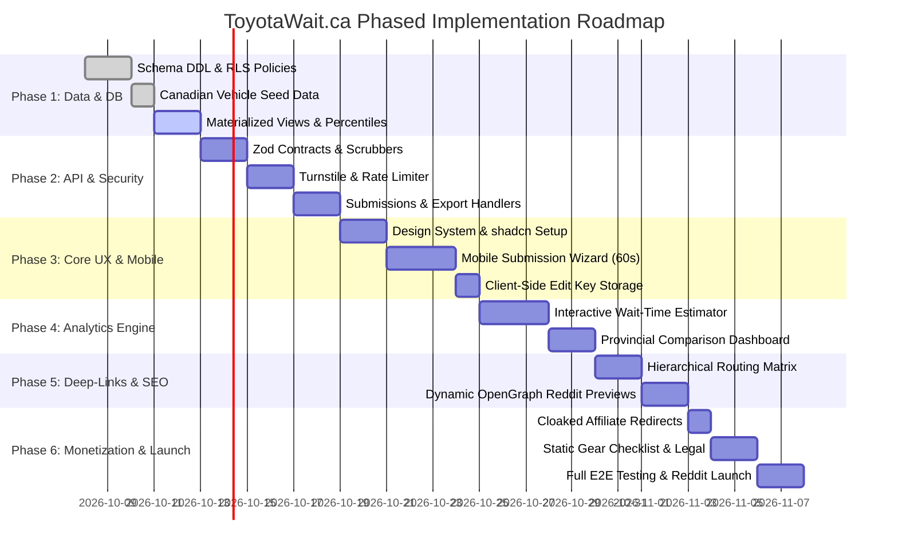

# Implementation Plan: ToyotaWait.ca
**Canadian Toyota Vehicle Delivery Wait-Time Community Tracker**  
*Document Version:* 1.0.0  
*Status:* Approved for Architecture Review  
*Target Domain:* `toyotawait.ca`

---

## 1. Executive Implementation Strategy

The development of ToyotaWait.ca follows a phased Spec-Driven Development (SDD) lifecycle. To ensure maximum reliability during viral Reddit traffic spikes and maintain uncompromising user privacy, execution progresses logically from the data and security layers outward to the presentation and monetization layers.

---

## 2. Phased Milestone Breakdown

### Phase 1: Database Setup, Relational Modeling & Seed Data
- **Objective**: Establish a secure, high-performance PostgreSQL persistence layer in Supabase with zero PII exposure and native percentile computations.
- **Deliverables**:
  1. Complete SQL migrations applied via Supabase CLI (`001_initial_schema.sql`, `002_materialized_view.sql`, `003_rls_policies.sql`).
  2. Complete Canadian seed dataset populated for RAV4 (Gas, HEV, PHEV), Sienna (HEV), Grand Highlander (Gas, HEV, MAX), and Land Cruiser (250 Series).
  3. Continuous percentile calculation verification via `mv_model_wait_summary`.
  4. Database benchmark tests verifying sub-15ms queries under synthetic load of 100,000 records.

### Phase 2: Backend API Layer, Validation & Bot Defense
- **Objective**: Build robust, authenticated-at-edge REST API endpoints with defense-in-depth sanitization, rate limiting, and zero-PII storage.
- **Deliverables**:
  1. Next.js 15 App Router API handlers (`/api/submissions`, `/api/aggregate`, `/api/export`, `/out/[slug]`).
  2. Server-side Cloudflare Turnstile token validation module.
  3. Ephemeral sliding-window IP rate limiting via Upstash Redis (`@upstash/ratelimit`).
  4. Honeypot silent rejection filter.
  5. PII scrubbing pipeline eliminating VINs, phone numbers, emails, and postal codes from optional notes.
  6. Cryptographic secret key generation (UUIDv4) and SHA-256 hash storage for zero-account editing.

### Phase 3: Mobile-First Core UX & Submission Wizard
- **Objective**: Craft an ultra-fast, frictionless submission experience allowing a smartphone user to submit their vehicle wait data in under 60 seconds.
- **Deliverables**:
  1. Tailwind CSS and shadcn/ui component library configured with clean automotive aesthetics and dark/light mode support.
  2. Cascading dynamic dropdowns: Model $\to$ Powertrain $\to$ Trim $\to$ Province.
  3. Interactive calendar/date pickers with bounds validation (preventing future dates or dates preceding model generation release).
  4. One-click secret edit key copy dialog and automatic persistence into browser `localStorage`.
  5. Inline client-side Zod validation with immediate error feedback.

### Phase 4: Statistical Engine, Aggregations & Interactive Estimator
- **Objective**: Deliver clear, transparent, actionable wait-time estimates and regional comparison charts.
- **Deliverables**:
  1. Interactive Wait-Time Estimator:
     - Dynamic query to `/api/aggregate`.
     - Visual confidence gauge based on sample size ($N$).
     - Clear percentile range display: 25th percentile (optimistic), Median (expected), 75th percentile (conservative).
  2. Regional Analytics Dashboard:
     - Cross-provincial median comparison bar chart (SVG/Recharts).
     - Trim-level wait variance visualizer.
     - Dealer markup & mandatory add-on index.
  3. RFC 4180 CSV export download button with dynamic filters.

### Phase 5: Hierarchical Dynamic Deep-Linking & Reddit Optimization
- **Objective**: Enable deep-link sharing across Canadian automotive forums and subreddits with dynamic OpenGraph image previews.
- **Deliverables**:
  1. App Router routes:
     - `/[model]` (e.g. `/rav4`)
     - `/[model]/[powertrain]` (e.g. `/rav4/phev`)
     - `/[model]/[powertrain]/[province]` (e.g. `/rav4/phev/bc`)
  2. Incremental Static Regeneration (ISR) with 300s cache revalidation.
  3. Dynamic OpenGraph image generator using `@vercel/og` displaying real-time median wait times for high Reddit click-through rates.
  4. Dynamic breadcrumbs and cross-province selector.

### Phase 6: Monetization, Compliance, SEO & Community Launch
- **Objective**: Establish sustainable non-intrusive affiliate monetization, complete Canadian legal disclosures, and execute community rollout.
- **Deliverables**:
  1. Cloaked redirect handler `/out/[slug]` with atomic click counter incrementation and zero client cookies.
  2. "Canadian New Toyota Delivery Checklist & Gear Guide" (`/checklist`) with actionable pickup tips and curated gear recommendations.
  3. Cookieless analytics integration (Umami/Plausible via Next.js proxy rewrite).
  4. Legal compliance disclosures (Canadian Competition Act, FTC, PIPEDA Zero-PII declaration).
  5. Community launch kit tailored for `r/rav4club`, `r/Toyota`, `r/PersonalFinanceCanada`, and RedFlagDeals.

---

## 3. Risk Analysis & Mitigation Matrix

| Identified Risk | Severity | Impact | Mitigation Strategy |
| :--- | :--- | :--- | :--- |
| **Data Poisoning / Malicious Trolling** *(Fake 2-day wait submissions)* | High | Compromises public data accuracy and credibility. | **Multi-tier defense**: (1) Strict sanity bounds (order date $\ge$ model generation launch; delivery $\ge$ order); (2) IQR outlier filtering in materialized views; (3) Cloudflare Turnstile bot challenge; (4) Hidden honeypot traps. |
| **Viral Reddit Traffic Spike** *(10,000+ concurrent visitors from r/all or r/PersonalFinanceCanada)* | High | Database connection exhaustion or slow response. | **Aggressive Edge ISR**: Dynamic routes cached at Cloudflare/Vercel edge for 300s. Summary API reads served from pre-aggregated Materialized View rather than raw table scans. Supabase Transaction Connection Pooling enabled. |
| **Dealer Pressure or Legal Challenges** | Medium | Cease-and-desist or complaint from dealerships. | **Strict Anonymity & Fair Use**: Zero PII collected. Community submissions are factual consumer experiences. Zero scraping of proprietary Toyota API/systems. Clear trademark disclaimer (*"ToyotaWait.ca is an independent community project not affiliated with Toyota Motor Corporation"*). |
| **Mobile Drop-Off on Form Submission** | Medium | Low data volume due to tedious form UX. | **60-Second Progressive Flow**: Minimal required fields (Model, Trim, Province, Dates). All financial transparency questions marked optional. No account creation required. |
| **Ad Blocker Breakage of Affiliate Links** | Low | Broken user experience when clicking gear recommendations. | **First-Party Cloaking**: Redirects route through first-party `/out/[slug]` server handler rather than third-party tracking networks (e.g. VigLink, Skimlinks). Transparent disclosure. |

---

## 4. Performance Budgets & Core Web Vitals Targets

To ensure instant loading on mobile devices across Canadian cellular networks (LTE/5G), the application enforces strict performance budgets:

- **Largest Contentful Paint (LCP)**: $< 1.2\text{s}$ on Mobile 4G.
- **First Input Delay (FID) / Interaction to Next Paint (INP)**: $< 50\text{ms}$.
- **Cumulative Layout Shift (CLS)**: $< 0.05$.
- **Total JavaScript Bundle Size**: $< 85\text{kB}$ gzipped on initial landing page.
- **API Response Time (`GET /api/aggregate`)**: $< 35\text{ms}$ at p95 (cached at Edge).
