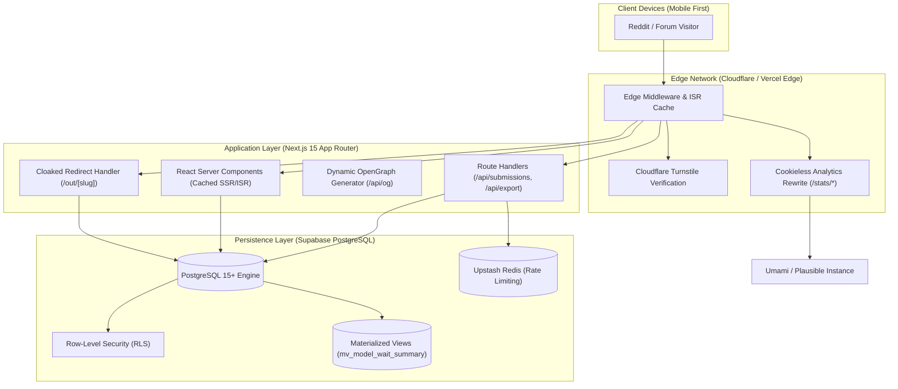
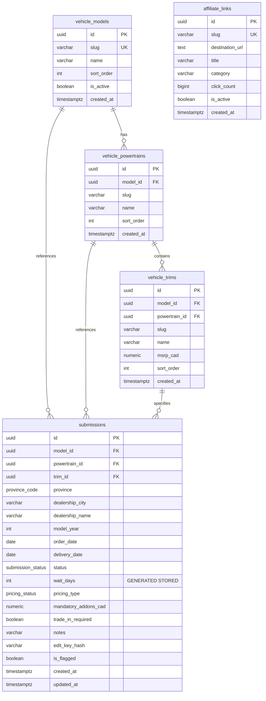

# Technical Architecture: ToyotaWait.ca
**Canadian Toyota Vehicle Delivery Wait-Time Community Tracker**  
*Document Version:* 1.0.0  
*Status:* Approved for Architecture Review  
*Target Domain:* `toyotawait.ca`

---

## 1. System Architecture Overview

ToyotaWait.ca is architected as an ultra-fast, mobile-first, edge-rendered web application optimized for instantaneous page loads, zero client-side tracking, and resilient community scaling during viral Reddit spikes.



### 1.1 Tech Stack Justification

| Layer | Technology | Key Selection Rationale |
| :--- | :--- | :--- |
| **Framework** | Next.js 15 (App Router, React 19) | Server Components minimize client JavaScript bundle; native Incremental Static Regeneration (ISR) ensures sub-100ms load times for deep links. |
| **Language** | TypeScript (Strict mode) | Type-safe data contracts across API endpoints, validation schemas, and database queries. |
| **Styling & UI** | Tailwind CSS + shadcn/ui | Zero-runtime CSS, fully accessible Radix primitives, mobile-first responsive design system. |
| **Database** | Supabase (Managed PostgreSQL 15+) | Rock-solid relational integrity, native Row-Level Security (RLS), generated columns, and rich statistical aggregation (`percentile_cont`). |
| **Rate Limiting** | Upstash Redis (@upstash/ratelimit) | Serverless-compatible, low-latency sliding window rate limiter at the edge without database lockups. |
| **Bot Protection** | Cloudflare Turnstile | Privacy-friendly, non-intrusive CAPTCHA replacement with zero Google tracking. |
| **Analytics** | Plausible / Umami (Proxied) | Cookieless, zero PII, 100% PIPEDA & GDPR compliant, proxied to bypass ad-blockers transparently. |

---

## 2. Hierarchical Deep-Link URL Routing

Community automotive traffic on platforms like `r/rav4club` or `r/PersonalFinanceCanada` is highly contextual. Users discussing RAV4 Prime deliveries in Ontario want an instant link to Ontario data, not a generic national home page.

### 2.1 Route Hierarchy Matrix

| URL Pattern | Page Purpose | ISR Revalidation | Canonical Metadata / Title |
| :--- | :--- | :--- | :--- |
| `/` | National Landing Page, Top Highlights, Global Estimator, Overall Leaderboard. | 120s | `ToyotaWait.ca | Real-Time Canadian Toyota Delivery Wait Times` |
| `/[model]` | Model Hub (e.g., `/rav4`, `/sienna`, `/grand-highlander`, `/land-cruiser`). | 300s | `Toyota RAV4 Delivery Wait Times Canada | ToyotaWait.ca` |
| `/[model]/[powertrain]` | Powertrain Hub (e.g., `/rav4/phev`, `/rav4/hev`, `/sienna/hev`). | 300s | `Toyota RAV4 Prime (PHEV) Wait Times in Canada | ToyotaWait.ca` |
| `/[model]/[powertrain]/[province]` | Deep-Link Target (e.g., `/rav4/phev/bc`, `/sienna/hev/on`). | 300s | `Toyota RAV4 Prime Wait Times in British Columbia | ToyotaWait.ca` |
| `/submit` | Fast, mobile-first submission wizard. | Dynamic | `Submit Your Toyota Wait Time (Anonymous) | ToyotaWait.ca` |
| `/checklist` | Canadian Toyota Delivery Checklist & Gear Guide. | 3600s | `New Toyota Delivery Inspection Checklist Canada | ToyotaWait.ca` |
| `/out/[slug]` | First-party cloaked affiliate redirect handler. | Cache-Control: no-store | *N/A (307 Temporary Redirect)* |
| `/api/export` | RFC 4180 CSV Data Export. | Dynamic (Edge cached 60s) | *N/A (text/csv response)* |

### 2.2 Dynamic OpenGraph Preview Generation (`/api/og`)
To maximize engagement when shared on Reddit, Discord, and Facebook, each deep-linked URL automatically generates an OpenGraph preview image:
- Generated using `@vercel/og` (Satori).
- Content includes: Model Name, Powertrain, Province flag/name, and live Median Wait Time (e.g., *"BC Median Wait: 412 Days (142 Deliveries Reported)"*).
- Yields a high click-through rate when posted as a comment link in Reddit threads asking *"What are current RAV4 Prime wait times in Vancouver?"*.

---

## 3. Relational Database Schema & Architecture

The database architecture is built on PostgreSQL 15 within Supabase, taking full advantage of strong typing, foreign key constraints, generated columns, and materialized views.



### 3.1 Design Principles
1. **Computed Columns**: `wait_days` is a PostgreSQL `GENERATED ALWAYS AS (delivery_date - order_date) STORED` column. It is computed at the database level, guaranteeing zero calculation discrepancy between client and server.
2. **Zero-PII Storage**: The schema intentionally contains **no fields** for user names, emails, IP addresses, VINs, or device identifiers.
3. **Cryptographic Self-Service Edits**: `edit_key_hash` stores the SHA-256 digest of a client-held 128-bit secret. Users can update their submission from `pending` to `delivered` by proving ownership of the preimage without accounts.
4. **Statistical Materialized View**: `mv_model_wait_summary` pre-calculates median, 25th, and 75th percentiles using PostgreSQL's native `percentile_cont` function, refreshed concurrently to guarantee sub-10ms response times for summary endpoints.

---

## 4. Complete SQL Migration Scripts & Seed Data

The following SQL migration scripts are designed to be run against Supabase / PostgreSQL 15+.

### 4.1 Schema DDL Migration (`001_initial_schema.sql`)

```sql
-- ============================================================================
-- TOYOTAWAIT.CA DATABASE INITIALIZATION SCRIPT
-- Migration: 001_initial_schema.sql
-- ============================================================================

-- Enable required extensions
CREATE EXTENSION IF NOT EXISTS "uuid-ossp";
CREATE EXTENSION IF NOT EXISTS "pgcrypto";

-- Clean existing enums if re-running
DO $$ BEGIN
    CREATE TYPE canadian_province AS ENUM (
        'AB', 'BC', 'MB', 'NB', 'NL', 'NS', 'NT', 'NU', 'ON', 'PE', 'QC', 'SK', 'YT'
    );
EXCEPTION WHEN duplicate_object THEN null; END $$;

DO $$ BEGIN
    CREATE TYPE submission_status AS ENUM (
        'pending', 'delivered', 'cancelled'
    );
EXCEPTION WHEN duplicate_object THEN null; END $$;

DO $$ BEGIN
    CREATE TYPE pricing_type AS ENUM (
        'at_msrp', 'above_msrp', 'below_msrp', 'undisclosed'
    );
EXCEPTION WHEN duplicate_object THEN null; END $$;

-- ----------------------------------------------------------------------------
-- 1. VEHICLE MODELS
-- ----------------------------------------------------------------------------
CREATE TABLE IF NOT EXISTS vehicle_models (
    id UUID PRIMARY KEY DEFAULT gen_random_uuid(),
    slug VARCHAR(50) NOT NULL UNIQUE,
    name VARCHAR(100) NOT NULL,
    manufacturer VARCHAR(50) NOT NULL DEFAULT 'Toyota',
    generation_start_year INT NOT NULL,
    is_active BOOLEAN NOT NULL DEFAULT true,
    sort_order INT NOT NULL DEFAULT 0,
    created_at TIMESTAMPTZ NOT NULL DEFAULT NOW()
);

CREATE INDEX IF NOT EXISTS idx_vehicle_models_slug ON vehicle_models(slug);

-- ----------------------------------------------------------------------------
-- 2. VEHICLE POWERTRAINS
-- ----------------------------------------------------------------------------
CREATE TABLE IF NOT EXISTS vehicle_powertrains (
    id UUID PRIMARY KEY DEFAULT gen_random_uuid(),
    model_id UUID NOT NULL REFERENCES vehicle_models(id) ON DELETE CASCADE,
    slug VARCHAR(50) NOT NULL,
    name VARCHAR(100) NOT NULL,
    sort_order INT NOT NULL DEFAULT 0,
    created_at TIMESTAMPTZ NOT NULL DEFAULT NOW(),
    CONSTRAINT uq_model_powertrain UNIQUE (model_id, slug)
);

CREATE INDEX IF NOT EXISTS idx_vehicle_powertrains_model_slug ON vehicle_powertrains(model_id, slug);

-- ----------------------------------------------------------------------------
-- 3. VEHICLE TRIMS
-- ----------------------------------------------------------------------------
CREATE TABLE IF NOT EXISTS vehicle_trims (
    id UUID PRIMARY KEY DEFAULT gen_random_uuid(),
    model_id UUID NOT NULL REFERENCES vehicle_models(id) ON DELETE CASCADE,
    powertrain_id UUID NOT NULL REFERENCES vehicle_powertrains(id) ON DELETE CASCADE,
    slug VARCHAR(80) NOT NULL,
    name VARCHAR(150) NOT NULL,
    msrp_cad NUMERIC(10, 2) NOT NULL,
    sort_order INT NOT NULL DEFAULT 0,
    created_at TIMESTAMPTZ NOT NULL DEFAULT NOW(),
    CONSTRAINT uq_powertrain_trim UNIQUE (powertrain_id, slug)
);

CREATE INDEX IF NOT EXISTS idx_vehicle_trims_powertrain ON vehicle_trims(powertrain_id);
CREATE INDEX IF NOT EXISTS idx_vehicle_trims_model ON vehicle_trims(model_id);

-- ----------------------------------------------------------------------------
-- 4. SUBMISSIONS (COMMUNITY CROWDSOURCED DATA)
-- ----------------------------------------------------------------------------
CREATE TABLE IF NOT EXISTS submissions (
    id UUID PRIMARY KEY DEFAULT gen_random_uuid(),
    model_id UUID NOT NULL REFERENCES vehicle_models(id) ON DELETE RESTRICT,
    powertrain_id UUID NOT NULL REFERENCES vehicle_powertrains(id) ON DELETE RESTRICT,
    trim_id UUID NOT NULL REFERENCES vehicle_trims(id) ON DELETE RESTRICT,
    province canadian_province NOT NULL,
    dealership_city VARCHAR(100),
    dealership_name VARCHAR(150),
    model_year INT NOT NULL CHECK (model_year BETWEEN 2019 AND 2028),
    order_date DATE NOT NULL CHECK (order_date <= CURRENT_DATE),
    delivery_date DATE CHECK (delivery_date <= CURRENT_DATE),
    status submission_status NOT NULL DEFAULT 'pending',
    
    -- Generated column calculating calendar wait duration in days
    wait_days INT GENERATED ALWAYS AS (
        CASE 
            WHEN delivery_date IS NOT NULL THEN (delivery_date - order_date) 
            ELSE NULL 
        END
    ) STORED,

    pricing pricing_type NOT NULL DEFAULT 'undisclosed',
    mandatory_addons_cad NUMERIC(10, 2) DEFAULT 0.00 CHECK (mandatory_addons_cad >= 0),
    trade_in_required BOOLEAN DEFAULT false,
    notes VARCHAR(280),
    
    -- Cryptographic hash of client-held secret token for zero-auth self-service updates
    edit_key_hash VARCHAR(64),
    
    is_flagged BOOLEAN NOT NULL DEFAULT false,
    created_at TIMESTAMPTZ NOT NULL DEFAULT NOW(),
    updated_at TIMESTAMPTZ NOT NULL DEFAULT NOW(),

    -- Consistency constraints
    CONSTRAINT chk_delivery_order_consistency CHECK (
        (status = 'delivered' AND delivery_date IS NOT NULL AND delivery_date >= order_date) OR
        (status != 'delivered' AND delivery_date IS NULL)
    ),
    CONSTRAINT chk_max_plausible_wait CHECK (
        wait_days IS NULL OR (wait_days >= 0 AND wait_days <= 1825)
    )
);

-- Performance Indexes for Aggregations & Deep Links
CREATE INDEX IF NOT EXISTS idx_submissions_deep_link 
    ON submissions(model_id, powertrain_id, province, status)
    WHERE is_flagged = false;

CREATE INDEX IF NOT EXISTS idx_submissions_wait_days 
    ON submissions(wait_days) 
    WHERE status = 'delivered' AND is_flagged = false;

CREATE INDEX IF NOT EXISTS idx_submissions_order_date 
    ON submissions(order_date DESC);

CREATE INDEX IF NOT EXISTS idx_submissions_edit_key 
    ON submissions(edit_key_hash) 
    WHERE edit_key_hash IS NOT NULL;

-- ----------------------------------------------------------------------------
-- 5. AFFILIATE LINKS (NON-INTRUSIVE CLOAKED MONETIZATION)
-- ----------------------------------------------------------------------------
CREATE TABLE IF NOT EXISTS affiliate_links (
    id UUID PRIMARY KEY DEFAULT gen_random_uuid(),
    slug VARCHAR(80) NOT NULL UNIQUE,
    destination_url TEXT NOT NULL,
    title VARCHAR(150) NOT NULL,
    category VARCHAR(80) NOT NULL DEFAULT 'accessories',
    click_count BIGINT NOT NULL DEFAULT 0,
    is_active BOOLEAN NOT NULL DEFAULT true,
    created_at TIMESTAMPTZ NOT NULL DEFAULT NOW(),
    updated_at TIMESTAMPTZ NOT NULL DEFAULT NOW()
);

CREATE INDEX IF NOT EXISTS idx_affiliate_links_slug ON affiliate_links(slug) WHERE is_active = true;

-- ----------------------------------------------------------------------------
-- 6. UPDATED_AT TRIGGER FUNCTION
-- ----------------------------------------------------------------------------
CREATE OR REPLACE FUNCTION trigger_set_timestamp()
RETURNS TRIGGER AS $$
BEGIN
  NEW.updated_at = NOW();
  RETURN NEW;
END;
$$ LANGUAGE plpgsql;

DROP TRIGGER IF EXISTS set_submissions_timestamp ON submissions;
CREATE TRIGGER set_submissions_timestamp
BEFORE UPDATE ON submissions
FOR EACH ROW EXECUTE PROCEDURE trigger_set_timestamp();

DROP TRIGGER IF EXISTS set_affiliate_timestamp ON affiliate_links;
CREATE TRIGGER set_affiliate_timestamp
BEFORE UPDATE ON affiliate_links
FOR EACH ROW EXECUTE PROCEDURE trigger_set_timestamp();
```

---

### 4.2 Materialized View & Statistical Functions (`002_materialized_view.sql`)

```sql
-- ============================================================================
-- STATISTICAL SUMMARY MATERIALIZED VIEW & REFRESH LOGIC
-- Migration: 002_materialized_view.sql
-- ============================================================================

DROP MATERIALIZED VIEW IF EXISTS mv_model_wait_summary;

CREATE MATERIALIZED VIEW mv_model_wait_summary AS
SELECT 
    m.id AS model_id,
    m.slug AS model_slug,
    m.name AS model_name,
    p.id AS powertrain_id,
    p.slug AS powertrain_slug,
    p.name AS powertrain_name,
    t.id AS trim_id,
    t.slug AS trim_slug,
    t.name AS trim_name,
    s.province,
    COUNT(*) AS total_samples,
    COUNT(*) FILTER (WHERE s.status = 'delivered') AS delivered_samples,
    COUNT(*) FILTER (WHERE s.status = 'pending') AS pending_samples,
    
    -- Percentile Calculations using continuous interpolation
    ROUND(CAST(percentile_cont(0.25) WITHIN GROUP (ORDER BY s.wait_days) AS numeric), 0) AS p25_wait_days,
    ROUND(CAST(percentile_cont(0.50) WITHIN GROUP (ORDER BY s.wait_days) AS numeric), 0) AS median_wait_days,
    ROUND(CAST(percentile_cont(0.75) WITHIN GROUP (ORDER BY s.wait_days) AS numeric), 0) AS p75_wait_days,
    ROUND(AVG(s.wait_days), 1) AS mean_wait_days,
    MIN(s.wait_days) AS min_wait_days,
    MAX(s.wait_days) AS max_wait_days,

    -- Dealer Transparency Aggregates
    COUNT(*) FILTER (WHERE s.pricing = 'above_msrp') AS above_msrp_count,
    COUNT(*) FILTER (WHERE s.pricing = 'at_msrp') AS at_msrp_count,
    ROUND(AVG(s.mandatory_addons_cad) FILTER (WHERE s.mandatory_addons_cad > 0), 2) AS avg_mandatory_addons,

    MAX(s.created_at) AS latest_submission_at
FROM submissions s
JOIN vehicle_models m ON s.model_id = m.id
JOIN vehicle_powertrains p ON s.powertrain_id = p.id
JOIN vehicle_trims t ON s.trim_id = t.id
WHERE s.is_flagged = false
GROUP BY 
    m.id, m.slug, m.name,
    p.id, p.slug, p.name,
    t.id, t.slug, t.name,
    s.province;

-- Unique index required for REFRESH MATERIALIZED VIEW CONCURRENTLY
CREATE UNIQUE INDEX IF NOT EXISTS uq_idx_mv_model_wait_summary 
    ON mv_model_wait_summary(model_id, powertrain_id, trim_id, province);

-- High-performance lookup indexes on the materialized view
CREATE INDEX IF NOT EXISTS idx_mv_summary_model_powertrain 
    ON mv_model_wait_summary(model_slug, powertrain_slug);

CREATE INDEX IF NOT EXISTS idx_mv_summary_deep_link 
    ON mv_model_wait_summary(model_slug, powertrain_slug, province);

-- Function to safely refresh materialized view
CREATE OR REPLACE FUNCTION refresh_wait_summary_mv()
RETURNS void AS $$
BEGIN
    REFRESH MATERIALIZED VIEW CONCURRENTLY mv_model_wait_summary;
END;
$$ LANGUAGE plpgsql SECURITY DEFINER;
```

---

### 4.3 Row-Level Security (RLS) Policies (`003_rls_policies.sql`)

```sql
-- ============================================================================
-- ROW-LEVEL SECURITY (RLS) POLICIES
-- Migration: 003_rls_policies.sql
-- ============================================================================

-- Enable RLS across all application tables
ALTER TABLE vehicle_models ENABLE ROW LEVEL SECURITY;
ALTER TABLE vehicle_powertrains ENABLE ROW LEVEL SECURITY;
ALTER TABLE vehicle_trims ENABLE ROW LEVEL SECURITY;
ALTER TABLE submissions ENABLE ROW LEVEL SECURITY;
ALTER TABLE affiliate_links ENABLE ROW LEVEL SECURITY;

-- 1. Reference Data: Public Read-Only Access
CREATE POLICY "Public can view active models"
    ON vehicle_models FOR SELECT
    USING (is_active = true);

CREATE POLICY "Public can view vehicle powertrains"
    ON vehicle_powertrains FOR SELECT
    USING (true);

CREATE POLICY "Public can view vehicle trims"
    ON vehicle_trims FOR SELECT
    USING (true);

-- 2. Submissions Security Policy
-- Anyone can view unflagged community submissions
CREATE POLICY "Public can view unflagged submissions"
    ON submissions FOR SELECT
    USING (is_flagged = false);

-- Public can insert new submissions
CREATE POLICY "Public can create anonymous submissions"
    ON submissions FOR INSERT
    WITH CHECK (
        is_flagged = false AND
        order_date <= CURRENT_DATE AND
        (delivery_date IS NULL OR delivery_date <= CURRENT_DATE)
    );

-- Self-Service Edit Policy: User can update their own row if providing matching edit_key_hash
CREATE POLICY "Owners can update own submission with edit key"
    ON submissions FOR UPDATE
    USING (
        edit_key_hash IS NOT NULL AND
        edit_key_hash = current_setting('request.headers', true)::json->>'x-edit-key-hash'
    )
    WITH CHECK (
        edit_key_hash IS NOT NULL AND
        edit_key_hash = current_setting('request.headers', true)::json->>'x-edit-key-hash'
    );

-- 3. Affiliate Links: Public Can View Active Redirect Targets
CREATE POLICY "Public can query active affiliate redirects"
    ON affiliate_links FOR SELECT
    USING (is_active = true);
```

---

### 4.4 Canadian Trim Seed Data Migration (`004_seed_canadian_data.sql`)

```sql
-- ============================================================================
-- INITIAL CANADIAN SEED DATA: RAV4, SIENNA, GRAND HIGHLANDER, LAND CRUISER
-- Migration: 004_seed_canadian_data.sql
-- ============================================================================

DO $$
DECLARE
    -- Model UUIDs
    m_rav4 UUID;
    m_sienna UUID;
    m_gh UUID;
    m_lc UUID;

    -- Powertrain UUIDs
    p_rav4_gas UUID;
    p_rav4_hev UUID;
    p_rav4_phev UUID;
    p_sienna_hev UUID;
    p_gh_gas UUID;
    p_gh_hev UUID;
    p_gh_max UUID;
    p_lc_hev UUID;
BEGIN

    -- ------------------------------------------------------------------------
    -- 1. VEHICLE MODELS
    -- ------------------------------------------------------------------------
    INSERT INTO vehicle_models (slug, name, generation_start_year, sort_order)
    VALUES 
        ('rav4', 'RAV4', 2019, 10),
        ('sienna', 'Sienna', 2021, 20),
        ('grand-highlander', 'Grand Highlander', 2024, 30),
        ('land-cruiser', 'Land Cruiser', 2024, 40)
    ON CONFLICT (slug) DO UPDATE SET name = EXCLUDED.name
    RETURNING id INTO m_rav4;

    SELECT id INTO m_rav4 FROM vehicle_models WHERE slug = 'rav4';
    SELECT id INTO m_sienna FROM vehicle_models WHERE slug = 'sienna';
    SELECT id INTO m_gh FROM vehicle_models WHERE slug = 'grand-highlander';
    SELECT id INTO m_lc FROM vehicle_models WHERE slug = 'land-cruiser';

    -- ------------------------------------------------------------------------
    -- 2. VEHICLE POWERTRAINS
    -- ------------------------------------------------------------------------
    -- RAV4 Powertrains
    INSERT INTO vehicle_powertrains (model_id, slug, name, sort_order)
    VALUES 
        (m_rav4, 'hev', 'Hybrid (HEV)', 1),
        (m_rav4, 'phev', 'Prime / Plug-in Hybrid (PHEV)', 2),
        (m_rav4, 'gas', 'Gasoline', 3)
    ON CONFLICT (model_id, slug) DO UPDATE SET name = EXCLUDED.name;

    SELECT id INTO p_rav4_hev FROM vehicle_powertrains WHERE model_id = m_rav4 AND slug = 'hev';
    SELECT id INTO p_rav4_phev FROM vehicle_powertrains WHERE model_id = m_rav4 AND slug = 'phev';
    SELECT id INTO p_rav4_gas FROM vehicle_powertrains WHERE model_id = m_rav4 AND slug = 'gas';

    -- Sienna Powertrain (All Canadian Siennas are HEV standard)
    INSERT INTO vehicle_powertrains (model_id, slug, name, sort_order)
    VALUES 
        (m_sienna, 'hev', 'Hybrid (HEV)', 1)
    ON CONFLICT (model_id, slug) DO UPDATE SET name = EXCLUDED.name;

    SELECT id INTO p_sienna_hev FROM vehicle_powertrains WHERE model_id = m_sienna AND slug = 'hev';

    -- Grand Highlander Powertrains
    INSERT INTO vehicle_powertrains (model_id, slug, name, sort_order)
    VALUES 
        (m_gh, 'hev', 'Hybrid (HEV)', 1),
        (m_gh, 'hybrid-max', 'Hybrid MAX', 2),
        (m_gh, 'gas', 'Gasoline Turbo', 3)
    ON CONFLICT (model_id, slug) DO UPDATE SET name = EXCLUDED.name;

    SELECT id INTO p_gh_hev FROM vehicle_powertrains WHERE model_id = m_gh AND slug = 'hev';
    SELECT id INTO p_gh_max FROM vehicle_powertrains WHERE model_id = m_gh AND slug = 'hybrid-max';
    SELECT id INTO p_gh_gas FROM vehicle_powertrains WHERE model_id = m_gh AND slug = 'gas';

    -- Land Cruiser Powertrain (250 Series - i-FORCE MAX Hybrid standard in Canada)
    INSERT INTO vehicle_powertrains (model_id, slug, name, sort_order)
    VALUES 
        (m_lc, 'hev', 'i-FORCE MAX Hybrid', 1)
    ON CONFLICT (model_id, slug) DO UPDATE SET name = EXCLUDED.name;

    SELECT id INTO p_lc_hev FROM vehicle_powertrains WHERE model_id = m_lc AND slug = 'hev';

    -- ------------------------------------------------------------------------
    -- 3. CANADIAN TRIMS SEED DATA
    -- ------------------------------------------------------------------------

    -- RAV4 PHEV (Prime) Trims
    INSERT INTO vehicle_trims (model_id, powertrain_id, slug, name, msrp_cad, sort_order)
    VALUES 
        (m_rav4, p_rav4_phev, 'se-awd', 'SE AWD', 51150.00, 1),
        (m_rav4, p_rav4_phev, 'xse-awd', 'XSE AWD', 55950.00, 2),
        (m_rav4, p_rav4_phev, 'xse-technology-awd', 'XSE AWD Technology Package', 61390.00, 3)
    ON CONFLICT (powertrain_id, slug) DO NOTHING;

    -- RAV4 HEV Trims
    INSERT INTO vehicle_trims (model_id, powertrain_id, slug, name, msrp_cad, sort_order)
    VALUES 
        (m_rav4, p_rav4_hev, 'le-awd', 'LE AWD', 36350.00, 1),
        (m_rav4, p_rav4_hev, 'xle-awd', 'XLE AWD', 39250.00, 2),
        (m_rav4, p_rav4_hev, 'woodland-awd', 'Woodland Edition AWD', 42350.00, 3),
        (m_rav4, p_rav4_hev, 'se-awd', 'SE AWD', 41050.00, 4),
        (m_rav4, p_rav4_hev, 'xse-awd', 'XSE AWD', 43850.00, 5),
        (m_rav4, p_rav4_hev, 'limited-awd', 'Limited AWD', 47250.00, 6)
    ON CONFLICT (powertrain_id, slug) DO NOTHING;

    -- RAV4 Gas Trims
    INSERT INTO vehicle_trims (model_id, powertrain_id, slug, name, msrp_cad, sort_order)
    VALUES 
        (m_rav4, p_rav4_gas, 'le-fwd', 'LE FWD', 33550.00, 1),
        (m_rav4, p_rav4_gas, 'le-awd', 'LE AWD', 35650.00, 2),
        (m_rav4, p_rav4_gas, 'xle-awd', 'XLE AWD', 38550.00, 3),
        (m_rav4, p_rav4_gas, 'trail-awd', 'Trail AWD', 42450.00, 4),
        (m_rav4, p_rav4_gas, 'limited-awd', 'Limited AWD', 46050.00, 5)
    ON CONFLICT (powertrain_id, slug) DO NOTHING;

    -- Sienna HEV Trims
    INSERT INTO vehicle_trims (model_id, powertrain_id, slug, name, msrp_cad, sort_order)
    VALUES 
        (m_sienna, p_sienna_hev, 'le-fwd', 'LE FWD (8-Passenger)', 45950.00, 1),
        (m_sienna, p_sienna_hev, 'le-awd', 'LE AWD (8-Passenger)', 47950.00, 2),
        (m_sienna, p_sienna_hev, 'xle-fwd', 'XLE FWD (8-Passenger)', 49290.00, 3),
        (m_sienna, p_sienna_hev, 'xse-fwd', 'XSE FWD (7-Passenger)', 51290.00, 4),
        (m_sienna, p_sienna_hev, 'xse-awd', 'XSE AWD (7-Passenger)', 53290.00, 5),
        (m_sienna, p_sienna_hev, 'xse-technology-awd', 'XSE Technology Package AWD', 58790.00, 6),
        (m_sienna, p_sienna_hev, 'limited-awd', 'Limited AWD (7-Passenger)', 63890.00, 7),
        (m_sienna, p_sienna_hev, 'platinum-awd', 'Platinum AWD (7-Passenger)', 67190.00, 8)
    ON CONFLICT (powertrain_id, slug) DO NOTHING;

    -- Grand Highlander Trims
    INSERT INTO vehicle_trims (model_id, powertrain_id, slug, name, msrp_cad, sort_order)
    VALUES 
        (m_gh, p_gh_gas, 'xle-awd', 'XLE AWD', 52990.00, 1),
        (m_gh, p_gh_hev, 'xle-hybrid-awd', 'XLE Hybrid AWD', 56290.00, 2),
        (m_gh, p_gh_hev, 'limited-hybrid-awd', 'Limited Hybrid AWD', 63650.00, 3),
        (m_gh, p_gh_max, 'limited-max-awd', 'Limited Hybrid MAX AWD', 67950.00, 4),
        (m_gh, p_gh_max, 'platinum-max-awd', 'Platinum Hybrid MAX AWD', 72050.00, 5)
    ON CONFLICT (powertrain_id, slug) DO NOTHING;

    -- Land Cruiser (250 Series) Trims
    INSERT INTO vehicle_trims (model_id, powertrain_id, slug, name, msrp_cad, sort_order)
    VALUES 
        (m_lc, p_lc_hev, '1958-grade', '1958 Grade', 71950.00, 1),
        (m_lc, p_lc_hev, 'land-cruiser-grade', 'Land Cruiser Grade', 79950.00, 2),
        (m_lc, p_lc_hev, 'land-cruiser-premium', 'Land Cruiser Grade with Premium Package', 85950.00, 3),
        (m_lc, p_lc_hev, 'first-edition', 'First Edition', 92950.00, 4)
    ON CONFLICT (powertrain_id, slug) DO NOTHING;

    -- ------------------------------------------------------------------------
    -- 4. INITIAL CLOAKED AFFILIATE REDIRECT SEED DATA
    -- ------------------------------------------------------------------------
    INSERT INTO affiliate_links (slug, destination_url, title, category)
    VALUES 
        ('tuxmat-rav4', 'https://www.amazon.ca/dp/B08XYZ1234?tag=toyotawait-20', 'TuxMat Custom Floor Liners (RAV4)', 'accessories'),
        ('tuxmat-sienna', 'https://www.amazon.ca/dp/B09ABC5678?tag=toyotawait-20', 'TuxMat Custom Floor Liners (Sienna 7/8 Passenger)', 'accessories'),
        ('viofo-a229-pro', 'https://www.amazon.ca/dp/B0CK123456?tag=toyotawait-20', 'VIOFO A229 Pro 4K HDR Dual Dash Cam', 'electronics'),
        ('screen-protector-12-3', 'https://www.amazon.ca/dp/B0BYZ98765?tag=toyotawait-20', '12.3-inch Infotainment Tempered Glass Screen Protector', 'accessories'),
        ('no-drill-mud-flaps-rav4', 'https://www.amazon.ca/dp/B07XYZ9999?tag=toyotawait-20', 'A-Premium No-Drill Mud Flaps Set for Toyota RAV4', 'exterior')
    ON CONFLICT (slug) DO NOTHING;

END $$;
```
